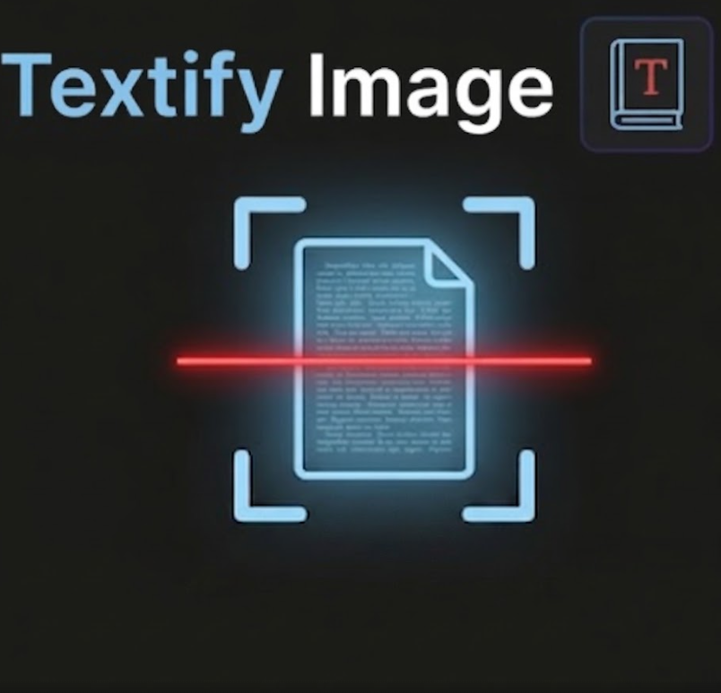

# Textify Image

<p align="center">
  
</p>

Paste or drop an image into a dedicated sidebar panel and extract text with **local OCR** via [Tesseract.js](https://github.com/naptha/tesseract.js).

**No API keys. No cloud. No cost.**

## Features

- Activity-bar icon → **Image to Text** panel
- Paste (`Ctrl+V` / `Cmd+V`), drag-and-drop, or pick a file
- Offline OCR (English by default)
- **Copy** result or **Insert into editor**
- Dark cyan / red scan UI with a live scan-line while OCR runs

## Install

### From Open VSX

Search for **Textify Image** in Cursor / VSCodium, or:

```bash
ovsx get ahmed404abd.textify-image
```

### From VSIX

1. Download the `.vsix` from [Releases](https://github.com/ahmed404abd/textify-image/releases)
2. VS Code / Cursor → **Extensions: Install from VSIX…**

### From source

```bash
npm install
npm run compile
npx vsce package
# then Install from VSIX
```

## Usage

1. Click the **Textify Image** icon in the activity bar (or run **Textify Image: Open Panel**).
2. Copy a screenshot / image to the clipboard.
3. Click the drop zone and press **Ctrl+V** (or drop / choose a file).
4. Wait for OCR, then **Copy** or **Insert into editor**.

## Tips

- Zoom or crop large screenshots — accuracy drops on dense / tiny text.
- Prefer high-contrast text.

## License

MIT
